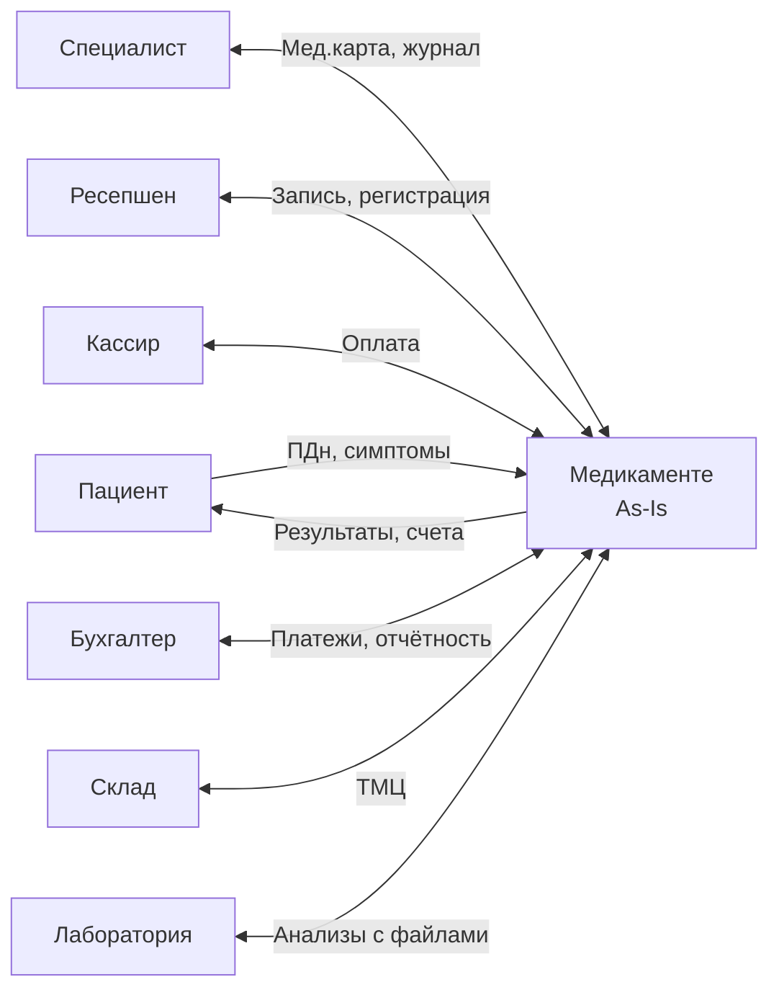
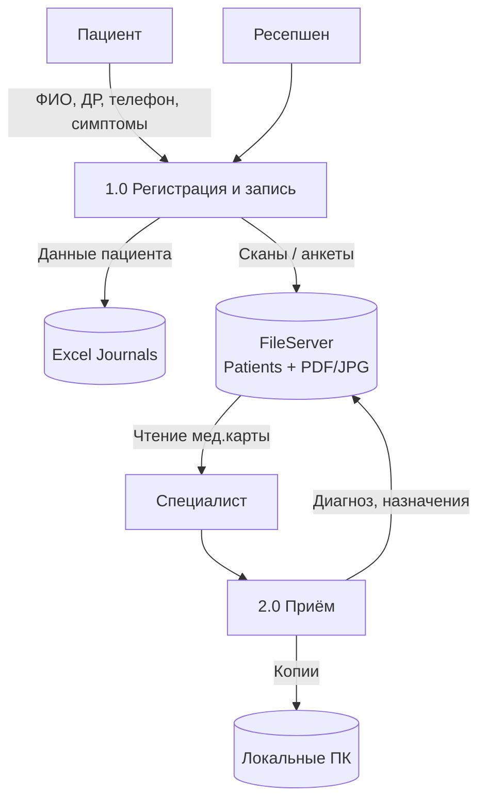
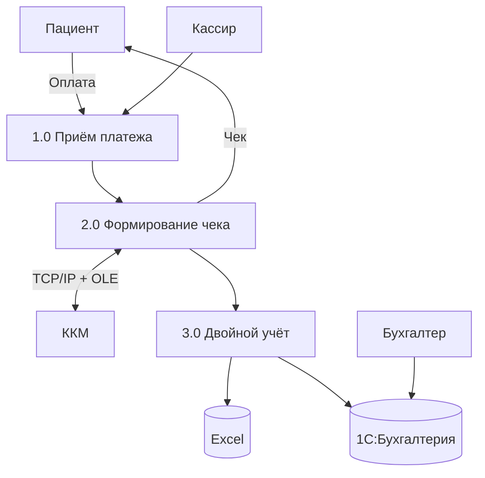
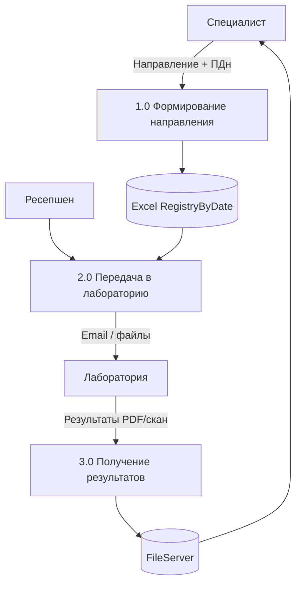

## Контекстная диаграмма

```mermaid
flowchart LR
    Patient[Пациент]
    Doctor[Специалист]
    Reception[Ресепшен]
    Cashier[Кассир]
    Bookkeeper[Бухгалтер]
    Warehouse[Склад]
    Lab[Лаборатория]
    System[Медикаменте
    As-Is]

    Patient --> |ПДн, симптомы| System
    System --> |Результаты, счета| Patient
    Doctor <--> |Мед.карта, журнал| System
    Reception <--> |Запись, регистрация| System
    Cashier <--> |Оплата| System
    Bookkeeper <--> |Платежи, отчётность| System
    Warehouse <--> |ТМЦ| System
    Lab <--> |Анализы с файлами| System
```

## Запись пациента и мед.карта

```mermaid
flowchart TB
    Patient[Пациент] --> |ФИО, ДР, телефон, симптомы| P1
    Reception[Ресепшен] --> P1[1.0 Регистрация и запись]
    
    P1 --> |Данные пациента| D1[(Excel Journals)]
    P1 --> |Сканы / анкеты| D2[(FileServer
    Patients + PDF/JPG)]
    
    Doctor[Специалист] --> P2[2.0 Приём]
    P2 --> |Диагноз, назначения| D2
    D2 --> |Чтение мед.карты| Doctor
    P2 --> |Копии| D3[(Локальные ПК)]
```

## Оплата услуг

```mermaid
flowchart TB
    Patient[Пациент] --> |Оплата| P1
    Cashier[Кассир] --> P1[1.0 Приём платежа]
    
    P1 --> P2[2.0 Формирование чека]
    P2 <--> |TCP/IP + OLE| KKM[ККМ]
    P2 --> |Чек| Patient
    
    P2 --> P3[3.0 Двойной учёт]
    P3 --> D1[(Excel)]
    P3 --> D2[(1С:Бухгалтерия)]
    
    Bookkeeper[Бухгалтер] --> D2
```

## Лабораторные анализы

```mermaid
flowchart TB
    Doctor[Специалист] --> |Направление + ПДн| P1[1.0 Формирование направления]
    P1 --> D1[(Excel RegistryByDate)]
    
    Reception[Ресепшен] --> P2[2.0 Передача в лабораторию]
    D1 --> P2
    P2 --> |Email / файлы| Lab[Лаборатория]
    
    Lab --> |Результаты PDF/скан| P3[3.0 Получение результатов]
    P3 --> D2[(FileServer)]
    D2 --> Doctor
```
