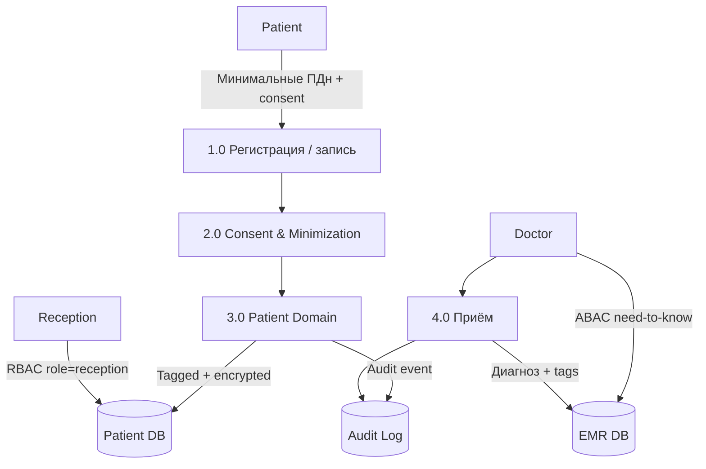

## Запись и мед.карта

```mermaid
flowchart TB
    Patient --> |Минимальные ПДн + consent| P1[1.0 Регистрация / запись]
    P1 --> P2[2.0 Consent & Minimization]
    P2 --> P3[3.0 Patient Domain]
    
    P3 -->|Tagged + encrypted| D1[(Patient DB)]
    P3 -->|Audit event| Audit[(Audit Log)]
    
    Reception --> |RBAC role=reception| D1
    Doctor --> |ABAC need-to-know| D2[(EMR DB)]
    
    Doctor --> P4[4.0 Приём]
    P4 --> |Диагноз + tags| D2
    P4 --> Audit
```
